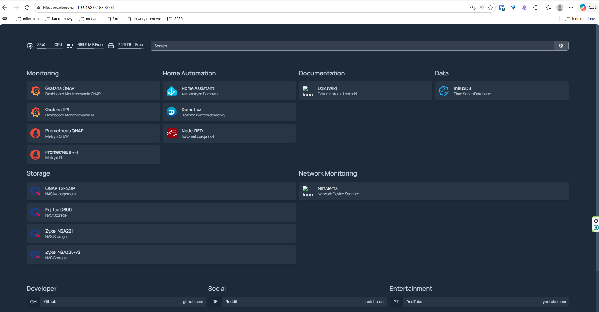
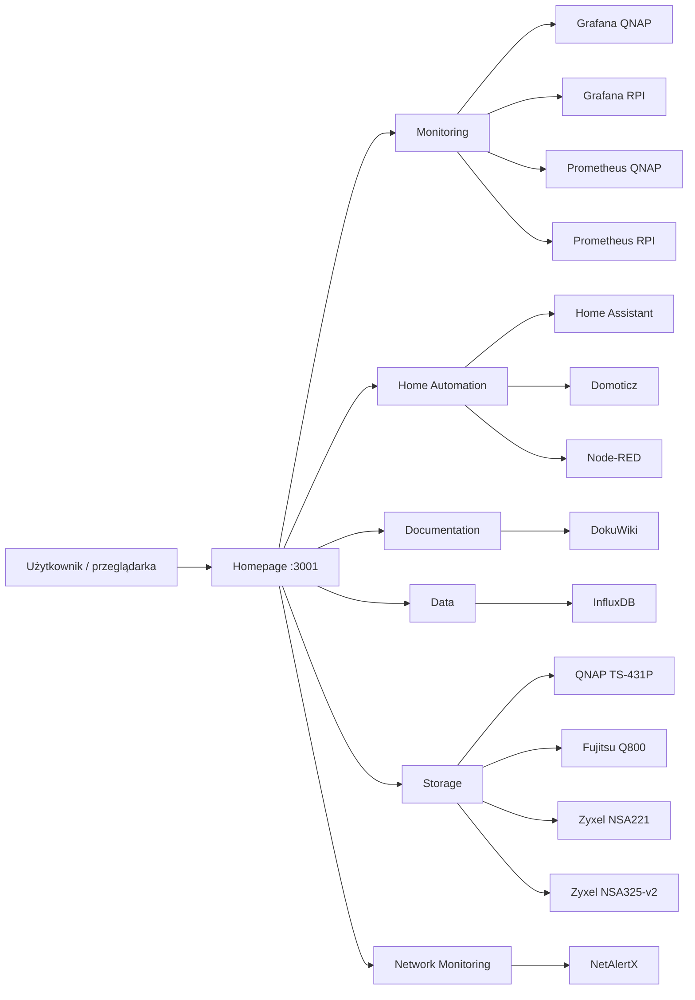

# Homepage na QNAP TS-431P – dashboard usług homelabu

Uruchomienie Homepage na QNAP TS-431P jako centralnej strony startowej do usług domowych. Dashboard zbiera w jednym miejscu najważniejsze aplikacje, monitoring, dokumentację i skróty do zasobów sieciowych. [file:655]

> Status: działa  
> Host: QNAP TS-431P  
> Adres: `http://192.168.0.168:3001`  
> Rola: dashboard / start page / portal usług [file:655]

## Cel

Celem było uruchomienie lekkiego, czytelnego dashboardu dla homelabu, który porządkuje dostęp do usług i zasobów sieciowych. Homepage pełni rolę jednej strony wejściowej do monitoringu, automatyki domowej, dokumentacji, storage i narzędzi codziennych. [file:655]

## Co pokazuje dashboard


Na ekranie głównym widać sekcje:
- Monitoring
- Home Automation
- Documentation
- Data
- Storage
- Network Monitoring
- Developer
- Social [file:655]

W dashboardzie są już podpięte między innymi:
- Grafana QNAP
- Grafana RPI
- Prometheus QNAP
- Prometheus RPI
- Home Assistant
- Domoticz
- Node-RED
- DokuWiki
- InfluxDB
- NetAlertX
- QNAP TS-431P
- Fujitsu Q800
- Zyxel NSA221
- Zyxel NSA325-v2 [file:655]

## Architektura



Dashboard nie zastępuje usług, tylko daje wspólną warstwę nawigacji do już działających aplikacji i hostów w sieci lokalnej. [file:655]

## Środowisko

- Urządzenie: QNAP TS-431P [cite:391]
- Typ wdrożenia: usługa dashboardowa dla homelabu
- Dostęp lokalny: `192.168.0.168:3001` [file:655]
- Charakter wdrożenia: wewnętrzny portal usług LAN [file:655]

## Zakres wykorzystania

Homepage został użyty jako:
- startowa strona administracyjna homelabu,
- szybki dostęp do monitoringu,
- punkt wejścia do usług automatyki,
- katalog urządzeń storage i narzędzi sieciowych. [file:655]

To podejście upraszcza codzienną pracę, bo zamiast pamiętać wiele adresów i portów, użytkownik wchodzi najpierw na jedną stronę zbiorczą. [file:655]

## Kluczowe sekcje

### Monitoring

Sekcja monitoringu grupuje skróty do dashboardów Grafany i endpointów Prometheusa dla QNAP-a i Raspberry Pi. To sugeruje, że Homepage pełni u Ciebie również funkcję panelu operacyjnego do szybkiego wejścia w obserwowalność środowiska. [file:655]

### Home Automation

W tej sekcji umieszczone są Home Assistant, Domoticz i Node-RED, czyli podstawowe elementy warstwy automatyki domowej. Dzięki temu portal łączy nie tylko monitoring, ale też zarządzanie logiką automatyzacji. [file:655]

### Storage

Sekcja storage zbiera odnośniki do kilku urządzeń NAS i storage w sieci, w tym QNAP TS-431P, Fujitsu Q800 i dwa urządzenia Zyxel. To robi z Homepage wygodne centrum nawigacyjne dla rozproszonej infrastruktury magazynowania danych. [file:655]

## Zrzuty ekranu

Warto dodać do folderu notatki screen, np.:

```text
content/homelab/qnap-homepage/
├── index.md
└── screen-01-homepage-dashboard.png
```

A w treści:

```md
## Zrzut ekranu


```

## Mocne strony rozwiązania

- Jeden punkt wejścia do usług homelabu. [file:655]
- Czytelny podział na kategorie funkcjonalne. [file:655]
- Szybszy dostęp do paneli administracyjnych i dashboardów. [file:655]
- Dobre rozwiązanie dla środowiska z wieloma hostami i portami. [file:655]

## Ograniczenia / uwagi

Na screenie połączenie jest oznaczone jako „Niezabezpieczona”, więc obecnie dostęp wygląda na HTTP bez pełnego HTTPS w przeglądarce. To jest akceptowalne w LAN, ale warto rozważyć później reverse proxy albo certyfikat lokalny, jeśli będziesz chciał dopracować bezpieczeństwo i wygodę dostępu. [file:655]

## To-Do

- [ ] Dodać opis sposobu wdrożenia Homepage na QNAP
- [ ] Uzupełnić informację, czy usługa działa w Container Station
- [ ] Dopisać lokalizację plików konfiguracyjnych
- [ ] Dodać backup konfiguracji dashboardu
- [ ] Opisać sposób aktualizacji
- [ ] Dodać screen mobilny / ciemny motyw
- [ ] Rozważyć HTTPS lub reverse proxy [file:655]

## Powiązane

- [Instalacja Homepage na QNAP TS-431P](./instalacja-homepage-na-qnapie)
- [QNAP TS-431P](../qnap-ts431p/)
- [Monitoring domowy](../../projekty/monitoring-domowy/)
- [Obserwowalność](../../serwery/obserwowalnosc/)