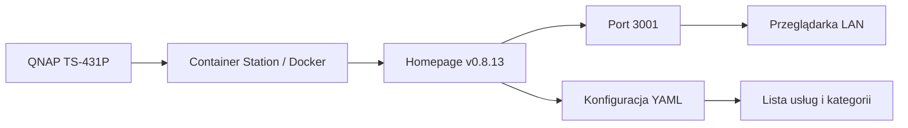

# Instalacja Homepage na QNAP TS-431P

Techniczna notatka z uruchomienia Homepage na QNAP TS-431P jako dashboardu usług homelabu. Finalnie wybrane zostało rozwiązanie Homepage zamiast Heimdall, ponieważ Heimdall odpadł przez brak wsparcia dla architektury ARM v7l, a nowsze wydania Homepage również przestały wspierać 32-bit ARM. [file:659]

## Dlaczego Homepage

Początkowo rozważany był Heimdall jako portal usług, ale ten wariant nie nadawał się do wdrożenia na QNAP TS-431P. Powodem był brak wsparcia dla architektury ARM v7l, na której działa urządzenie. [file:659]

Homepage okazał się lepszym wyborem, ale nie w wersji `latest`. Z notatek wynika, że użyta została wersja `v0.8.13`, ponieważ nowsze wydania również porzuciły wsparcie dla 32-bit ARM. [file:659]

## Cel wdrożenia

Celem było stworzenie jednej strony startowej dla usług homelabu, z której można szybko wejść do monitoringu, automatyki domowej, dokumentacji i storage. Dashboard miał działać lokalnie, być lekki oraz możliwy do wygodnej edycji po wdrożeniu. [file:659][file:655]

## Środowisko

- Urządzenie: QNAP TS-431P [cite:391]
- Architektura istotna dla wdrożenia: ARM v7l [file:659]
- Typ wdrożenia: Docker / Container Station [file:659]
- Dostęp lokalny: `http://192.168.0.168:3001` [file:655]

## Architektura wdrożenia



Homepage działa jako lekki dashboard kontenerowy na QNAP-ie i udostępnia stronę startową przez port 3001 w sieci lokalnej. [file:655][file:659]

## Wersja obrazu

Kluczowym elementem wdrożenia był dobór zgodnej wersji obrazu. W notatce wdrożeniowej wskazane jest, że finalnie użyta została wersja `0.8.13`, a nie `latest`, właśnie z uwagi na zgodność z architekturą urządzenia. [file:659]

## Konfiguracja Docker Compose

W streszczeniu jest informacja, że finalnie został przygotowany gotowy `docker-compose.yml`. Sam plik nie jest tu rozpisany w treści załącznika, ale warto zachować w tej notatce miejsce na jego finalną wersję, żeby później mieć pełną dokumentację wdrożenia. [file:659]

Przykładowa sekcja do uzupełnienia:

```yaml
services:
  homepage:
    image: ghcr.io/gethomepage/homepage:v0.8.13
    container_name: homepage
    ports:
      - "3001:3000"
    volumes:
      - /share/Container/homepage/config:/app/config
    restart: unless-stopped
```

Ten blok potraktuj jako roboczy szablon do podmiany na finalny plik, którego użyłeś rzeczywiście na QNAP-ie. Wersja `v0.8.13` jest zgodna z ustaleniami z notatki wdrożeniowej. [file:659]

## Struktura konfiguracji

Z opisu sesji wynika, że ważny był również wygodny workflow późniejszej edycji przez WinSCP. To sugeruje, że konfiguracja Homepage była przechowywana w katalogu mapowanym z hosta QNAP, tak aby można ją było modyfikować bez grzebania bezpośrednio w kontenerze. [file:659]

Warto utrzymywać w konfiguracji osobne pliki dla:
- usług,
- układu,
- widgetów,
- ustawień dashboardu.

## Co zostało dodane do dashboardu

Na działającym dashboardzie widać między innymi:
- Grafana QNAP
- Grafana RPI
- Prometheus QNAP
- Prometheus RPI
- Home Assistant
- Domoticz
- Node-RED
- DokuWiki
- InfluxDB
- NetAlertX
- QNAP TS-431P
- Fujitsu Q800
- Zyxel NSA221
- Zyxel NSA325-v2 [file:655]

Dashboard został więc użyty jako centralny katalog usług LAN, a nie tylko jako lista pojedynczych aplikacji. [file:655]

## Zrzut ekranu


Screen pokazuje działający dashboard z podziałem na sekcje Monitoring, Home Automation, Documentation, Data, Storage, Network Monitoring, Developer i Social. [file:655][file:660]

## Co było ważne przy wdrożeniu

- Heimdall odpadł przez brak wsparcia ARM v7l. [file:659]
- `latest` Homepage nie był dobrym wyborem dla tego QNAP-a. [file:659]
- Trzeba było użyć starszej, zgodnej wersji `v0.8.13`. [file:659]
- Konfiguracja miała być łatwa do późniejszej edycji, stąd workflow z WinSCP. [file:659]

## Wnioski

Homepage dobrze sprawdza się jako lekki portal usług dla homelabu na starszym QNAP-ie, o ile dobierze się zgodną wersję obrazu. Najważniejszy wniosek z tego wdrożenia jest taki, że przy urządzeniach ARM trzeba zawsze sprawdzać kompatybilność obrazu, a nie zakładać, że `latest` będzie działać poprawnie. [file:659]

## To-Do

- [ ] Wkleić finalny `docker-compose.yml`
- [ ] Dopisać dokładną ścieżkę katalogu konfiguracyjnego na QNAP
- [ ] Opisać sposób aktualizacji kontenera
- [ ] Dodać backup konfiguracji Homepage
- [ ] Uzupełnić listę plików YAML używanych do konfiguracji