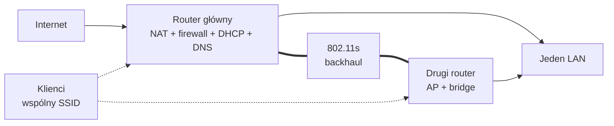

# Dwa routery TP-Link z OpenWrt — od repeatera do wspólnego Wi-Fi

> Szkic publiczny. Przed publikacją trzeba uzupełnić wyniki wdrożenia i ponownie sprawdzić anonimizację.

## Punkt wyjścia

Domowe Wi-Fi opierało się na dwóch routerach TP-Link TL-WDR3600 v1. Pierwszy obsługiwał łącze internetowe i główny LAN, a drugi łączył się bezprzewodowo i tworzył własną podsieć.

Taki układ rozszerzał zasięg, ale dodawał drugą warstwę NAT, osobny DHCP i utrudniał dostęp do usług działających w głównej sieci.

## Cel

Projekt zakłada:

- jedną bramę internetową;
- jeden serwer DHCP;
- dwa punkty dostępowe w jednym LAN-ie;
- wspólny SSID dla klientów;
- szyfrowany backhaul 802.11s między routerami;
- stały dostęp administracyjny do obu urządzeń;
- backup konfiguracji i plan rollbacku.

## Jeden SSID a mesh

Identyczna nazwa sieci na obu pasmach i obu punktach dostępowych nie tworzy automatycznie mesha. Klient widzi kilka BSSID i sam wybiera punkt dostępowy.

802.11s pełni inną rolę: przenosi ruch pomiędzy routerami. Sieci klienckie nadal są zwykłymi interfejsami AP.

## Audyt przed zmianą

Przed przebudową zostały sprawdzone:

- modele i wersje sprzętowe;
- wersje OpenWrt;
- pakiety odpowiedzialne za Wi-Fi;
- konfiguracja interfejsów i DHCP;
- nośniki USB oraz extroot;
- możliwość wykonania kopii `sysupgrade`.

Audyt ujawnił, że główny router ma działający extroot i nowszy stos Wi-Fi, natomiast drugi wymaga osobnego etapu modernizacji.

## Architektura docelowa

## Bezpieczna kolejność

1. Odczyt bieżącej konfiguracji.
2. Backup i lista pakietów.
3. Aktualizacja drugiego routera jako osobny etap.
4. Test dostępu po kablu.
5. Włączenie drugiego urządzenia do głównego LAN-u.
6. Wyłączenie dodatkowego DHCP i NAT.
7. Konfiguracja 802.11s.
8. Uruchomienie wspólnego SSID.
9. Testy DNS, roamingu i restartu.
10. Dopiero później segmentacja VLAN.

## Wnioski

Najważniejszą zmianą nie jest sam mesh. Jest nią przejście od konfiguracji, która po prostu działa, do infrastruktury z opisanymi rolami, kopiami konfiguracji, punktami kontrolnymi i przewidywalnym sposobem odtworzenia.

## Do uzupełnienia

- wyniki wdrożenia;
- pomiary roamingu;
- zachowanie po restarcie;
- końcowe wersje OpenWrt;
- zanonimizowane fragmenty konfiguracji;
- diagram fizyczny.
