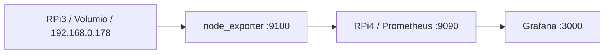
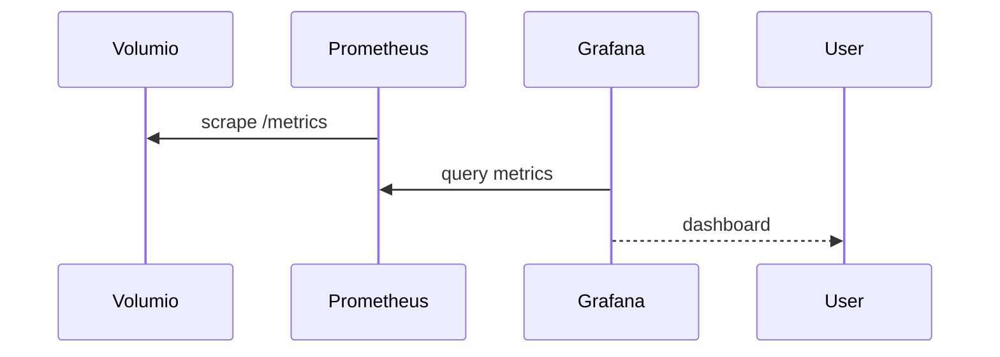

# Volumio RPi3 – Monitoring i Konfiguracja

> Notatka z konfiguracji monitoringu Volumio na Raspberry Pi 3 (192.168.0.178)  
> Serwer Prometheus/Grafana: Raspberry Pi 4 (192.168.0.182)  
> Data: Marzec 2026

---

## Architektura

```
RPi3 (Volumio)          RPi4 (Ubuntu Server)
192.168.0.178    →      192.168.0.182
node_exporter:9100  →   prometheus:9090 → grafana:3000
```

---

## 1. Node Exporter na RPi3 (Volumio)

Volumio działa na Debian Bookworm (armhf). Node Exporter był już zainstalowany.

### Instalacja (jeśli brak)
```bash
sudo apt update
sudo apt install -y prometheus-node-exporter
sudo systemctl enable --now prometheus-node-exporter
```

### Sprawdzenie
```bash
sudo systemctl status prometheus-node-exporter
curl http://192.168.0.178:9100/metrics | head -20
```

---

## 2. Prometheus na RPi4 – Dodanie Volumio jako target

### Struktura plików (RPi4)
```
~/docker-services/
├── docker-compose.yml
├── prometheus.yml        ← config Prometheus (volume mount)
└── volumes/
    └── prometheus-data/  ← dane Prometheus
```

### Problem: Read-only filesystem w kontenerze

Kontener `prom/prometheus` montuje `/etc/prometheus` jako **read-only**.  
Nie można edytować pliku bezpośrednio w kontenerze przez `docker exec`.

### Rozwiązanie: Volume mount z hosta

#### 1. Wyciągnij aktualny config z kontenera
```bash
docker exec prometheus cat /etc/prometheus/prometheus.yml > prometheus.yml
```

#### 2. Edytuj lokalnie prometheus.yml – dodaj job
```yaml
scrape_configs:
  # ... istniejące joby ...

  - job_name: 'volumio-rpi3'
    scrape_interval: 10s
    static_configs:
      - targets: ['192.168.0.178:9100']
```

#### 3. Dodaj volume mount do docker-compose.yml
```yaml
services:
  prometheus:
    volumes:
      - ./volumes/prometheus-data:/prometheus
      - ./prometheus.yml:/etc/prometheus/prometheus.yml:ro
```

#### 4. Restart kontenera
```bash
docker compose down prometheus
docker compose up -d prometheus
```

#### 5. Weryfikacja
```bash
docker exec prometheus tail -20 /etc/prometheus/prometheus.yml
```

**Targets UI:** http://192.168.0.182:9090/targets → volumio-rpi3 UP

---

## 3. Grafana – Dashboard Node Exporter Full

### Import dashboardu
1. Grafana → Dashboards → New → Import
2. Wpisz ID: **1860**
3. Kliknij Load
4. Wybierz datasource: Prometheus
5. Kliknij Import

### Filtry dashboardu
```
Job:      volumio-rpi3
Nodename: volumio
Instance: 192.168.0.178:9100
```

### Zmiana nazwy dashboardu
Grafana blokuje edycję dashboardów importowanych.  
Obejście: Save as copy z nową nazwą:
```
Dashboard otwarty → Save → Save as → "Volumio RPi3 Monitoring"
```

---

## 4. Screen Blanking – Volumio RPi3

### Ważne: Nie edytuj /boot/config.txt!
```
### DO NOT EDIT THIS FILE ###
### APPLY CUSTOM PARAMETERS TO userconfig.txt ###
```

### Fix 1: /boot/userconfig.txt
```bash
sudo nano /boot/userconfig.txt
```
```
# No screen blanking
hdmi_blanking=0
disable_splash=1
hdmi_force_hotplug=1
vt_global_cursor_default=0
```

### Fix 2: /boot/cmdline.txt – consoleblank kernel parameter

Dodaj `consoleblank=900` (15 minut) po `console=tty1`:

```bash
sudo nano /boot/cmdline.txt
```

Oryginalna linia:
```
... quiet console=serial0,115200 console=tty1 imgpart=UUID=... imgfile=/volumio_current.sqsh ...
```

Po zmianie:
```
... quiet console=serial0,115200 console=tty1 consoleblank=900 imgpart=UUID=... imgfile=/volumio_current.sqsh ...
```

### Fix 3: systemd service (keep-alive loop)
```bash
sudo tee /etc/systemd/system/volumio-screenalive.service << 'EOF'
[Unit]
Description=Volumio Screen Alive
After=multi-user.target

[Service]
Type=simple
ExecStart=/bin/sh -c 'while true; do echo > /dev/tty1 2>/dev/null || true; sleep 60; done'
Restart=always

[Install]
WantedBy=multi-user.target
EOF

sudo systemctl daemon-reload
sudo systemctl enable --now volumio-screenalive
```

### Restart
```bash
sudo reboot
```

---

## 5. Cheatsheet

| Co | Komenda |
|---|---|
| Status node_exporter (RPi3) | `sudo systemctl status prometheus-node-exporter` |
| Metryki RPi3 z RPi4 | `curl http://192.168.0.178:9100/metrics \| head -20` |
| Config Prometheus | `docker exec prometheus cat /etc/prometheus/prometheus.yml \| tail -20` |
| Restart Prometheus | `docker compose restart prometheus` |
| Targets Prometheus | http://192.168.0.182:9090/targets |
| Grafana | http://192.168.0.182:3000 |

---

## 6. Gotowy prometheus.yml

```yaml
global:
  scrape_interval: 15s
  evaluation_interval: 15s

scrape_configs:
  - job_name: 'prometheus'
    static_configs:
      - targets: ['localhost:9090']

  - job_name: 'node-exporter'
    static_configs:
      - targets: ['node-exporter:9100']

  - job_name: 'hp-printer'
    scrape_interval: 60s
    scrape_timeout: 10s
    static_configs:
      - targets: ['hp-printer-exporter:9200']

  - job_name: 'openwrt-router'
    scrape_interval: 30s
    static_configs:
      - targets: ['192.168.0.1:9100']

  - job_name: 'telegraf-qnap'
    scrape_interval: 15s
    static_configs:
      - targets: ['telegraf:9273']
    metrics_path: '/metrics'

  - job_name: 'volumio-rpi3'
    scrape_interval: 10s
    static_configs:
      - targets: ['192.168.0.178:9100']
```

---

## Status końcowy

- [x] Node Exporter działa na RPi3 Volumio (port 9100)
- [x] Prometheus scrape volumio-rpi3 co 10s
- [x] Grafana Dashboard 1860 "Volumio RPi3 Monitoring"
- [x] Screen blanking ustawiony na 15 minut (consoleblank=900)


---
## Architektura



## Przepływ monitoringu

