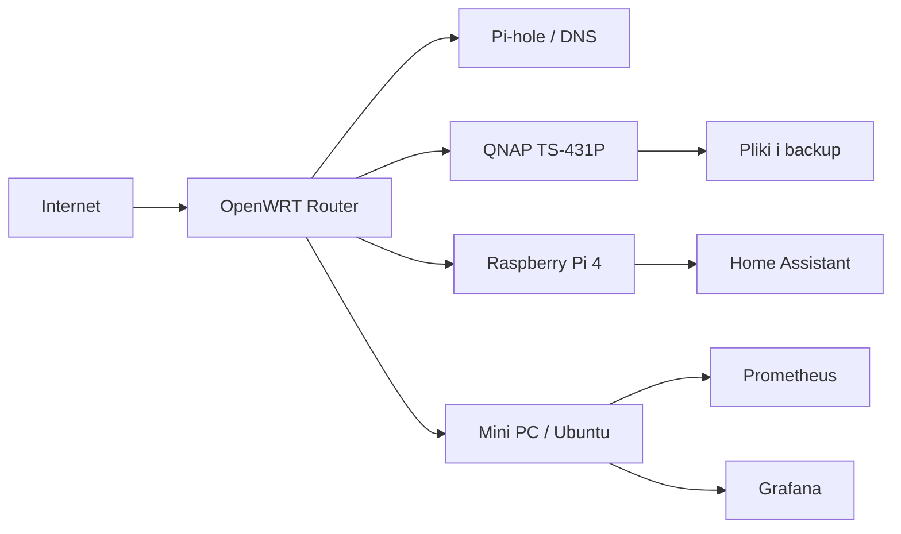
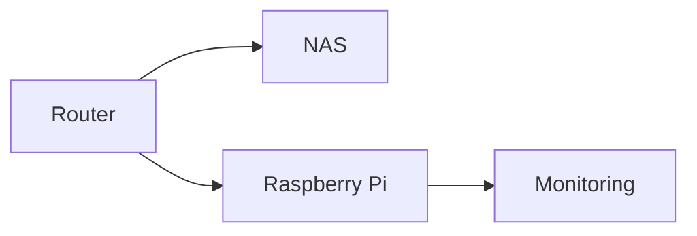

# Mermaid - architektura homelabu

To przykład prostego diagramu architektury homelabu w Mermaid. Taki układ dobrze nadaje się do opisu routera, NAS-a, Raspberry Pi i usług monitoringu.

## Wersja architektury

### Kod

````md

````

### Wynik


## Zasada

Do opisywania architektury homelabu w Quartz najbezpieczniej używać `flowchart`, bo jest prosty, czytelny i renderuje się stabilnie.

## Kiedy używać

Taki diagram przydaje się, gdy chcę szybko pokazać:
- główne urządzenia w sieci,
- zależności między nimi,
- gdzie działają konkretne usługi,
- które elementy odpowiadają za monitoring, DNS albo storage.

## Własny wariant

Ten przykład można łatwo rozbudować o kolejne elementy, na przykład:
- dodatkowy NAS,
- osobny serwer backupu,
- Home Assistant,
- Node-RED,
- DokuWiki,
- Homepage,
- Pi-hole zapasowy.

## Minimalny wzór

### Kod

````md

````

### Wynik

