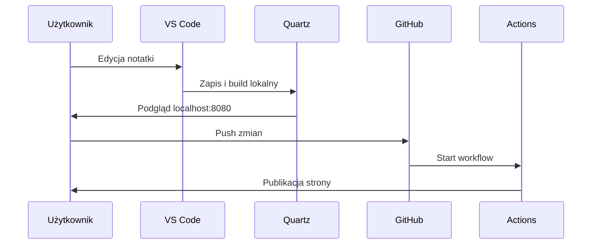

# Mermaid - edycja notatki, localhost i GitHub

To jest praktyczny diagram pokazujący typowy przepływ pracy: edycja notatki, lokalny podgląd i publikacja na GitHub.

## Diagram przepływu

### Kod

````md

````

### Wynik


```mermaid
flowchart LR
    A[Edycja w VS Code] --> B[Zapis pliku]
    B --> C[npx quartz build --serve]
    C --> D[Sprawdzenie localhost:8080]
    D --> E[git status]
    E --> F[git add .]
    F --> G[git commit -m 'opis zmian']
    G --> H[git pull --rebase origin main]
    H --> I[git push origin main]
    I --> J[GitHub Actions]
    J --> K[Publikacja Quartz]
```

## Diagram sekwencji

### Kod

````md

````

### Wynik


## Zasada

Takie diagramy najlepiej sprawdzają się jako szybka ściąga do codziennej pracy z Quartz. Quartz obsługuje Mermaid bezpośrednio w notatkach, a flowchart i sequenceDiagram należą do podstawowych wspieranych typów. [web:694][web:670]