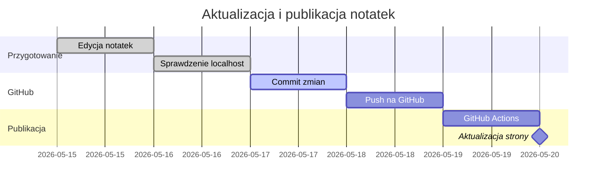

# Mermaid - gantt w Quartz

Diagram Gantta w Mermaid przydaje się do prostego pokazywania etapów prac, kolejności działań i zależności czasowych.

## Prosty gantt

### Kod

````md

````

### Wynik


## Zasada

Diagram Gantta zaczynam od słowa `gantt`, potem ustawiam `title`, `dateFormat`, sekcje i zadania. Mermaid pozwala oznaczać zadania jako `done`, `active` oraz `milestone`. [web:688][web:691]