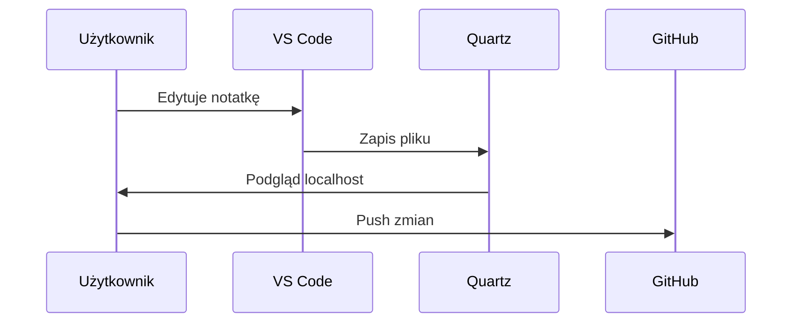

# Mermaid w Quartz

Mermaid pozwala dodawać diagramy bezpośrednio w Markdown przez blok kodu oznaczony jako `mermaid`.

## Najprostszy diagram

### Kod

````md

````

### Wynik


## Diagram sekwencji

### Kod

````md

````

### Wynik


## Zasada

Kod Mermaid wpisuję zawsze między potrójne backticki i poprzedzam słowem `mermaid`. Jeśli chcę pokazać sam kod jako przykład, zamykam go w osobnym bloku z czterema backtickami, a niżej dodaję właściwy blok renderujący diagram. [web:675][web:673]

## Najkrótszy wzór

### Kod

````md

````

### Wynik

